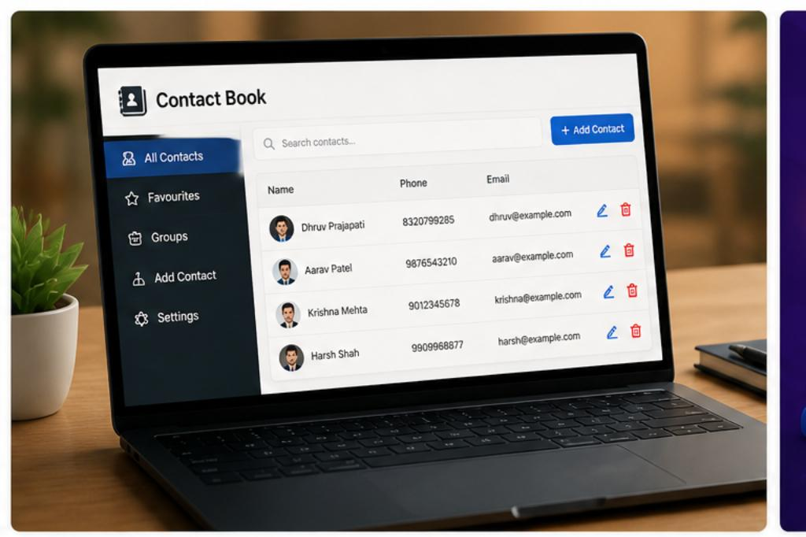
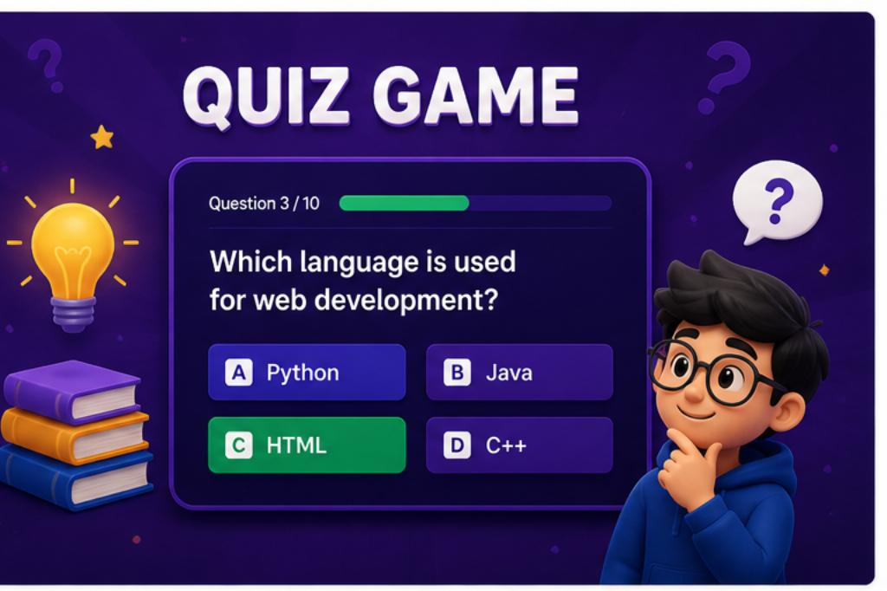
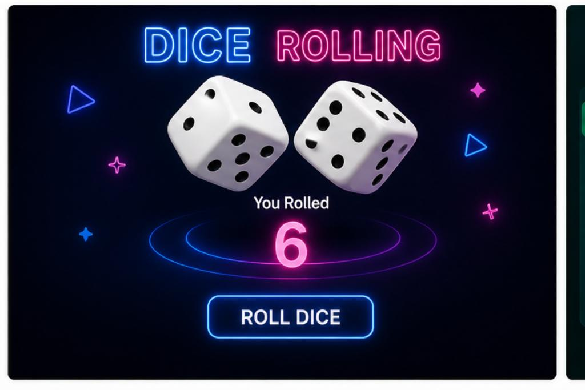
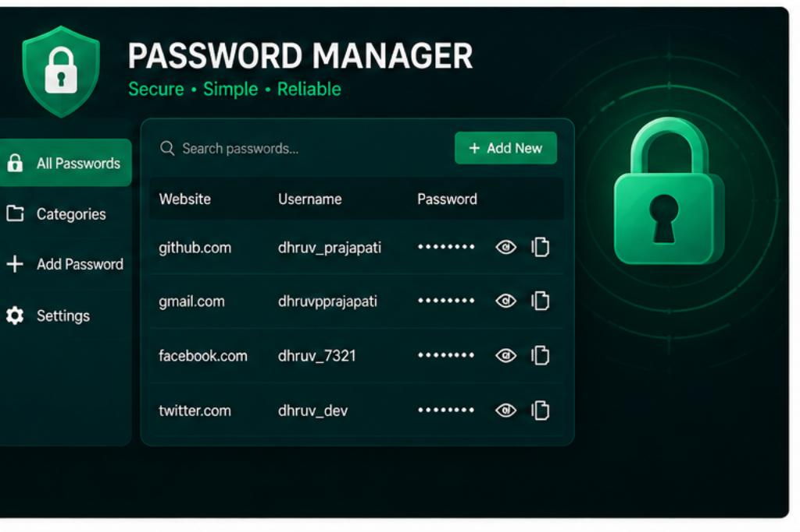

  

  
  
  
  

---

## 🌐 About Project   

💡 This is a **modern, responsive and stylish portfolio website** built using
**HTML + CSS (No Framework)** with smooth UI, animations and interactive elements.

🚀 Designed to showcase skills, projects and contact details in a professional way.

---

  

## ✨ Features

* 🎨 Beautiful Gradient UI Design
* ✨ Typing Animation Effect
* 🟢 Profile Image with Online Status Dot
* 🌙 Dark Mode Toggle
* 🖱️ Cursor Glow Effect
* 🎬 Scroll Animations (AOS)
* 📂 Project Image Cards
* 📸 Responsive Layout
* 📞 Contact Section with Hover Cards
* 💬 WhatsApp Direct Chat Button
* 🔗 Clickable Links (GitHub & LinkedIn)
* 🎯 Clean & Professional UI

---

  

## 📸 Project Preview

| 📘 Contact Book          | 🧠 Quiz Game          |
| ------------------------ | --------------------- |
|  |  |

| 🎲 Dice Rolling       | 🔐 Password Manager       |
| --------------------- | ------------------------- |
|  |  |

---

  

## 🛠️ Tech Used

* HTML5
* CSS3
* JavaScript
* AOS Animation Library

---

  

## 🔗 Connect With Me

* 💼 LinkedIn: https://www.linkedin.com/in/dhruv-prajapati-616b89362/
* 🐱 GitHub: https://github.com/dhruvprajapati6

---

  

## 👨‍💻 Author

**Dhruv Prajapati**
🚀 Python Developer | 🛡️ Cyber Security Learner

---

## ⭐ Support

If you like this project, give it a ⭐ on GitHub!
